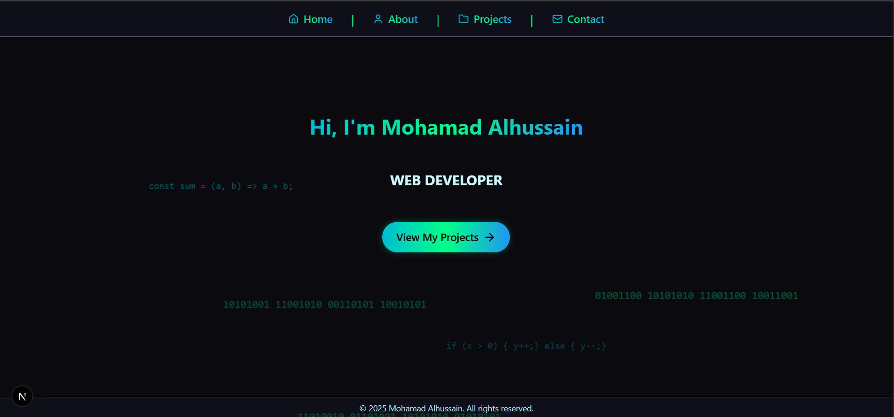

# Mohamad Alhussain Portfolio



## 🚀 Live Site

[https://alhussain.netlify.app](https://alhussain.netlify.app)

## 📦 Repository

[GitHub Repo](https://github.com/MohamadAlhussain/Portfolio-Mohamad)

---

## 📝 About This Project

This is my personal portfolio website, built to showcase my web development projects, skills, and certifications. The design is modern, responsive, and inspired by a cyber/tech aesthetic. It features animated backgrounds, project cards, and a clean, professional layout.

---

## ✨ Features

- Animated code-inspired background
- Responsive design for all devices
- Project showcase with live demos and GitHub links
- Downloadable certificates
- Contact section with direct links
- SEO optimized (robots.txt, sitemap.xml, meta tags)

---

## 🛠️ Tech Stack

- [Next.js](https://nextjs.org/)
- [React](https://react.dev/)
- [TypeScript](https://www.typescriptlang.org/)
- [Tailwind CSS](https://tailwindcss.com/)
- [Lucide Icons](https://lucide.dev/)
- Deployed on [Vercel](https://vercel.com/)

---

## 🖥️ Getting Started

1. **Clone the repo:**
   ```bash
   git clone https://github.com/MohamadAlhussain/Portfolio-Mohamad.git
   cd Portfolio-Mohamad
   ```
2. **Install dependencies:**
   ```bash
   npm install
   ```
3. **Run locally:**
   ```bash
   npm run dev
   ```
4. **Build for production:**
   ```bash
   npm run build
   npm start
   ```

---

## 📚 What I Learned

- Building a modern, animated portfolio with Next.js and Tailwind CSS
- Implementing responsive layouts and custom animations
- Optimizing for SEO (robots.txt, sitemap.xml, meta tags)
- Deploying on Vercel and connecting a custom domain
- Managing project structure and code cleanliness
- Using Git and GitHub for version control and collaboration

---

Built with ❤️ by Mohamad Alhussain
